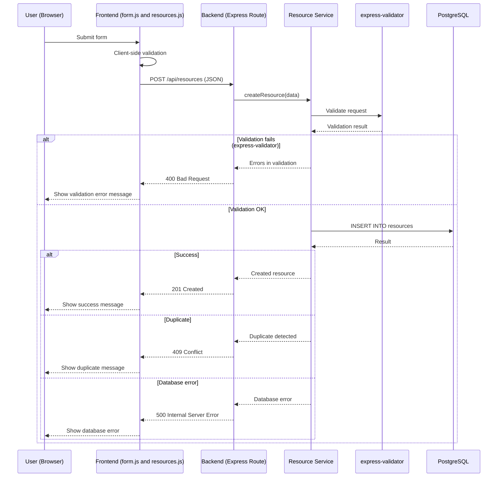
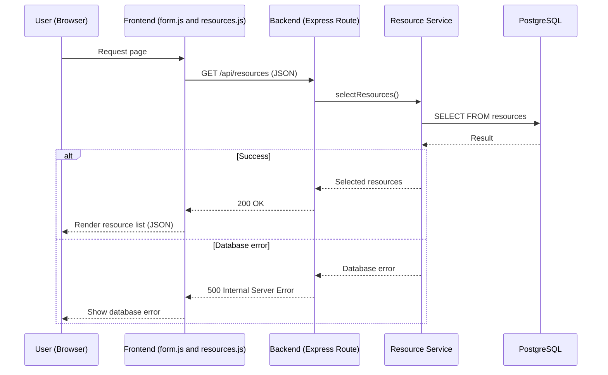
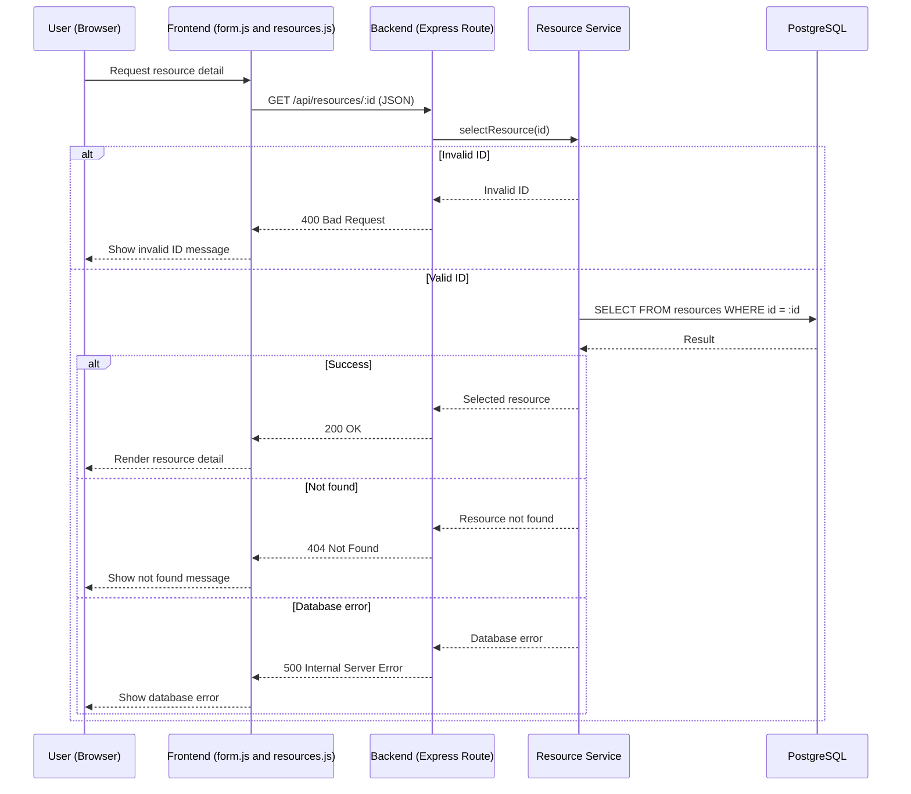
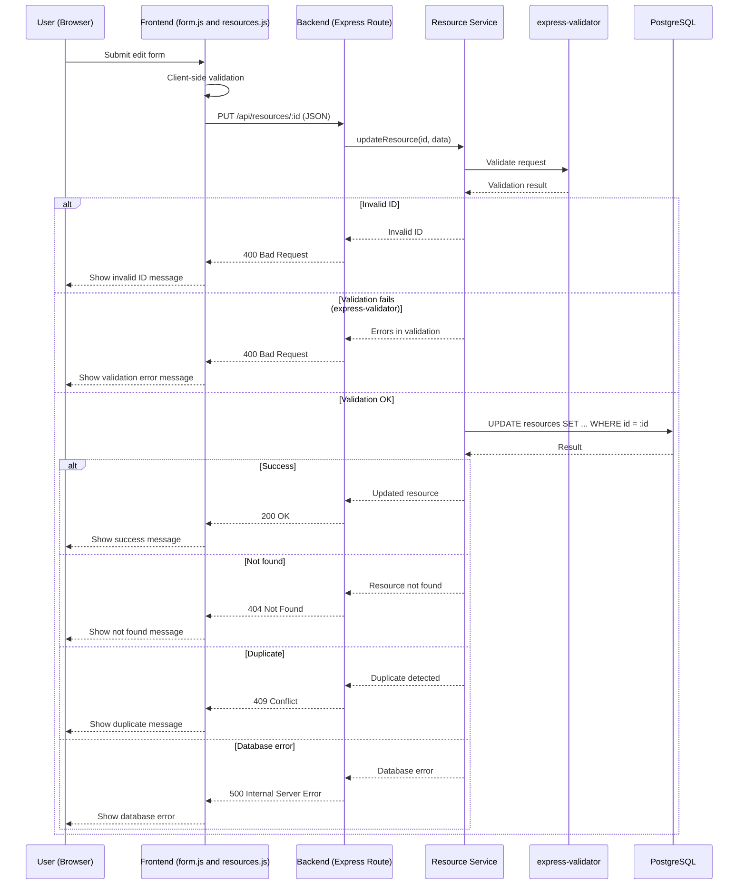
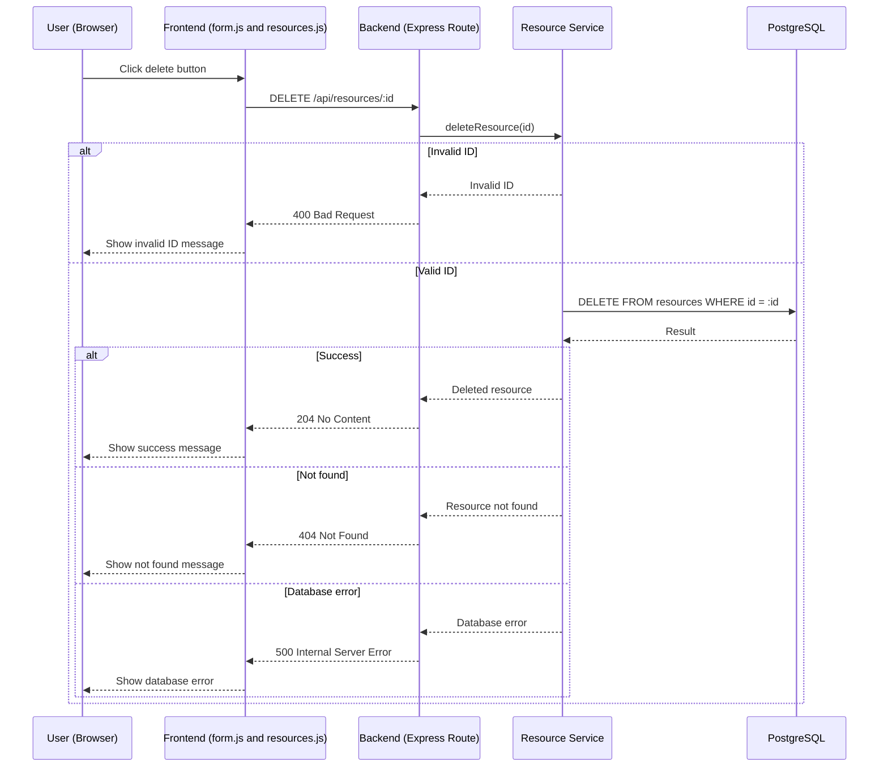

# G1 – CRUD Data Flow: Booking System (Phase 6)

---

# 1️⃣ CREATE – Resource (Sequence Diagram)

---

# 2️⃣ READ – Resource (Sequence Diagram)

## READ – All Resources

## READ – Single Resource by ID

---

# 3️⃣ UPDATE – Resource (Sequence Diagram)

---

# 4️⃣ DELETE – Resource (Sequence Diagram)

